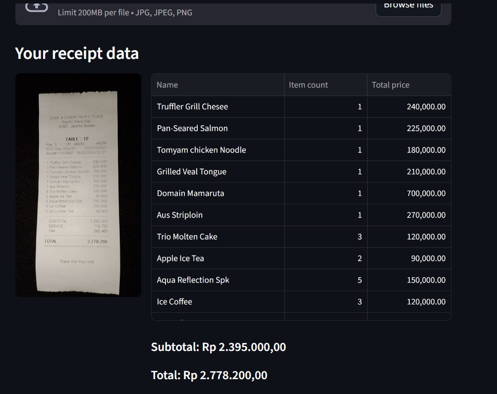

# Split Bill Application

This repository contains AI-based application for splitting-bill, written on python (streamlit) and can be run on your local computer.

this repository is clone from https://github.com/MukhlasAdib/split-bill-app and giving upgrade with extra model to support OCR

link for Mr. Manfred https://drive.google.com/drive/folders/1lW-FLpT3w_5yXf3FUJvCpSlM_rj_hzct?usp=sharing

## Features

With this application, you can upload a photo of your receipt. The AI will read the receipt and show you the data.



Then, you can list participants of your split-bill, and then assign items from the receipt to each of them.


When you are done, final report will be shown.


## Installation

1. Make sure Python is installed (any recent version should be fine, I tested with Python 3.12)
2. Create environment for this application

   ```bash
   pip install virtualenv
   python -m env .ven
   ```

3. Activate the environment

   if using Linux

   ```bash
   source .venv/bin/activate
   ```

   if using Windows

   ```powershell
   .\.venv\Scripts\activate
   ```

4. Install required libraries

   ```bash
   pip install -r requirements.txt
   ```

## Run Application

1. Activate the environment

   if using Linux

   ```bash
   source .venv/bin/activate
   ```

   if using Windows

   ```powrshell
   .\.venv\Scripts\activate
   ```

2. Start the app

   ```bash
   streamlit run app.py
   ```
